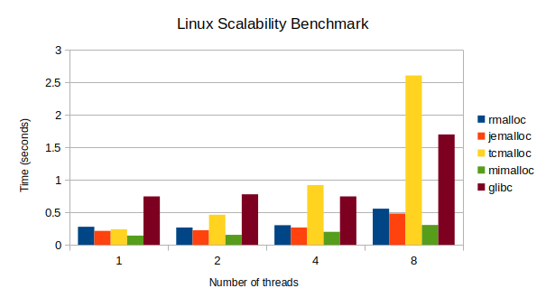
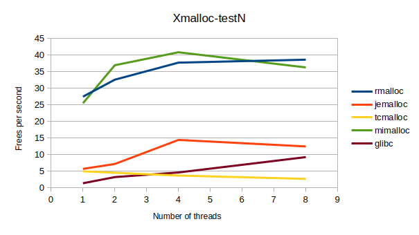
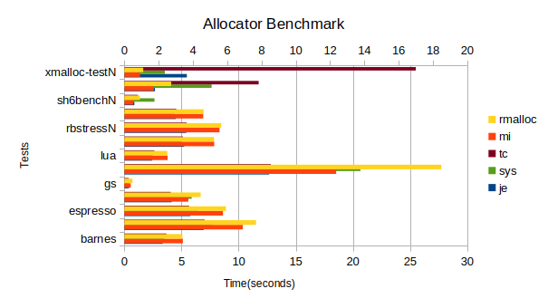

rmalloc is designed to be a fast concurrent memory allocator with low
fragmentation, low latency and high throughput. rmalloc draws inspiration
from mainly mimalloc, jemalloc, slab allocator and tcmalloc. rmalloc was 
created by Romario Newell as an exploration into the memory allocator
design space. Romario designed this allocator with simplicity in mind
making it approachable for anyone wanting to understand and develop
a viable production-quality memory allocator. 


# Notable Features

-   rmalloc is small and consistent. rmalloc is about 6k LOC making
    it easy to digest. Additionally, rmalloc code is well documented.

-   fast and highly concurrent. rmalloc outperforms jemalloc, tcmalloc
    and ptmalloc2 on xmalloc-testN benchmark. This is significant since 
    xmalloc-testN benchmark is known to really stress test allocators.

-   smart recycling. Active empty slabs in rmalloc can be reused by
    different threads. Also threads participate in the cooperative 
    recycling to return idle memory to the operating system. This 
    keeps memory usage low.


# Benchmark

No memory allocator is complete without a benchmark against mimalloc,
jemalloc, tcmalloc or ptmalloc2. rmalloc was benchmarked against the 
aforementioned allocators. We provide a few benchmarks below were 
rmalloc is highly competitive or even better in some instances 
against established allocators.







# Build
```
git clone https://github.com/newell-romario/rmalloc.git
cd rmalloc 
cmake --preset linux
cmake --build --prest linux-release
```
# Use

After building, use directly from build directory. 
```
LD_PRELOAD=./build/lib/librmalloc.so ./myprogram
```